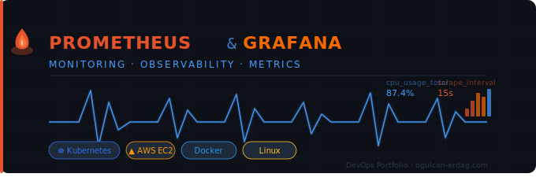

# 🚀 Prometheus & Grafana Monitoring Projects


---

## 📖 Overview

This repository showcases **real-world monitoring implementations** using **Prometheus** and **Grafana**.

It is designed as a **DevOps portfolio project**, demonstrating practical skills in:

- Infrastructure monitoring
- Cloud deployment (AWS EC2)
- Kubernetes observability
- Metrics visualization

---

## 🏗 Architecture

```
+-------------------+
|   Target Systems  |
| (EC2 / Kubernetes)|
+---------+---------+
          |
          v
+-------------------+
|   Prometheus      |
| (Metrics Scraper) |
+---------+---------+
          |
          v
+-------------------+
|     Grafana       |
| (Visualization)   |
+-------------------+
```

---

## 📂 Projects

### 🔹 S1 – Prometheus & Grafana on EC2

- Install Prometheus & Grafana on Ubuntu EC2
- Configure services
- Access dashboards via browser

📁 `S1-Installing-prom-grafana-on-ec2`

---

### 🔹 S2 – Kubernetes Monitoring

- Monitor K8s cluster using Prometheus
- Deploy exporters and scrape metrics
- Visualize with Grafana dashboards

📁 `S2-Monitoring-K8s-cluster-with-prometheus-grafana`

---

## 🛠 Tech Stack

- **Prometheus**
- **Grafana**
- **AWS EC2**
- **Kubernetes**
- **Linux (Ubuntu)**

---

## 📊 Screenshots

> Add your Grafana dashboard screenshots here

Example:

```
/screenshots/dashboard.png
```

---

## 🎯 Key Skills Demonstrated

- Monitoring & Observability
- Metrics collection & alerting
- Cloud infrastructure setup
- Kubernetes monitoring
- Dashboard design

---

## 🚀 How to Use

```bash
git clone https://github.com/your-username/your-repo.git
cd your-repo
```

Then follow each project's README.

---

## 🤝 Contributing

Pull requests are welcome. For major changes, open an issue first.

---
